# Battlelands Royale Private Server

Reverse-engineering and local server implementation for Battlelands Royale v2.9.6 (Unity 2018.4.31f1, IL2CPP).

## Screenshots

The original 2.9.6 client running against the private PlayFab backend and Photon Master/GameServer (Waydroid), up to the playable training battle.

| | |
|:---:|:---:|
| 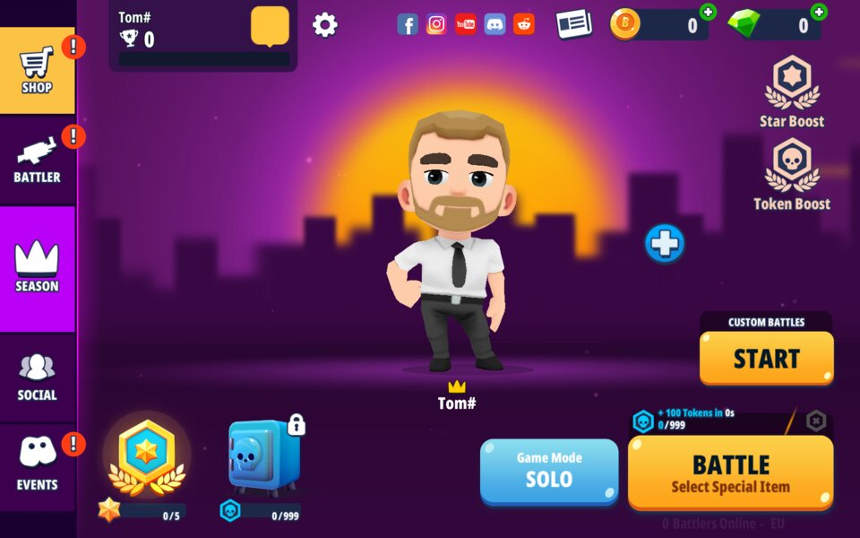 | 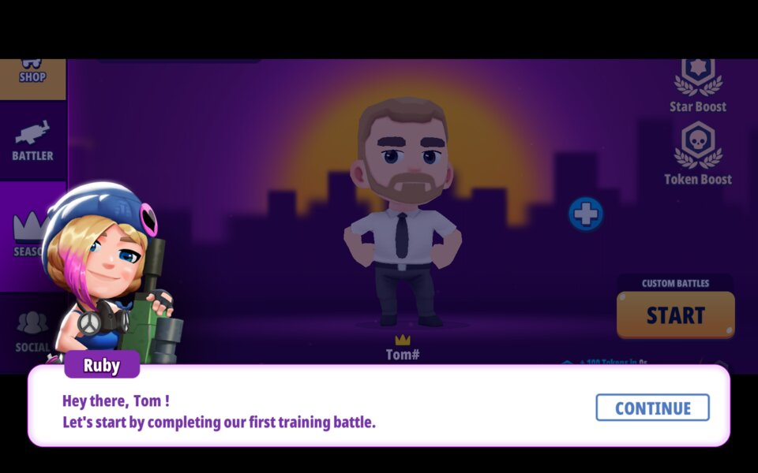 |
| Lobby after login, BattleTag set | Tutorial, before the first training battle |
| 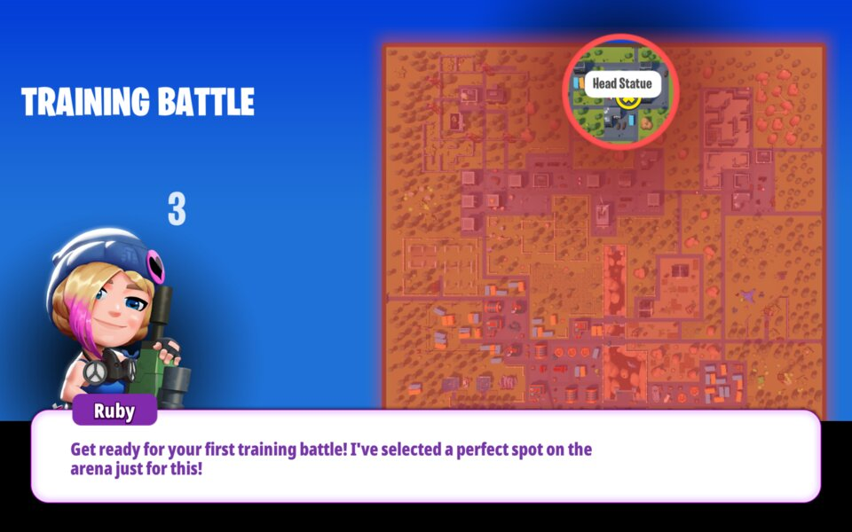 | 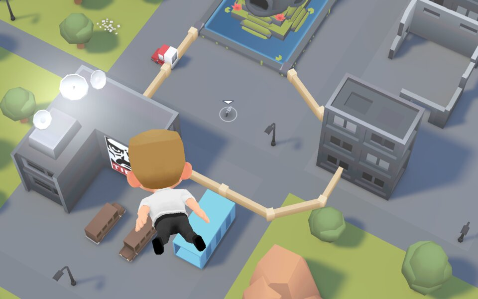 |
| Training battle: drop zone selection | Parachute drop |
| 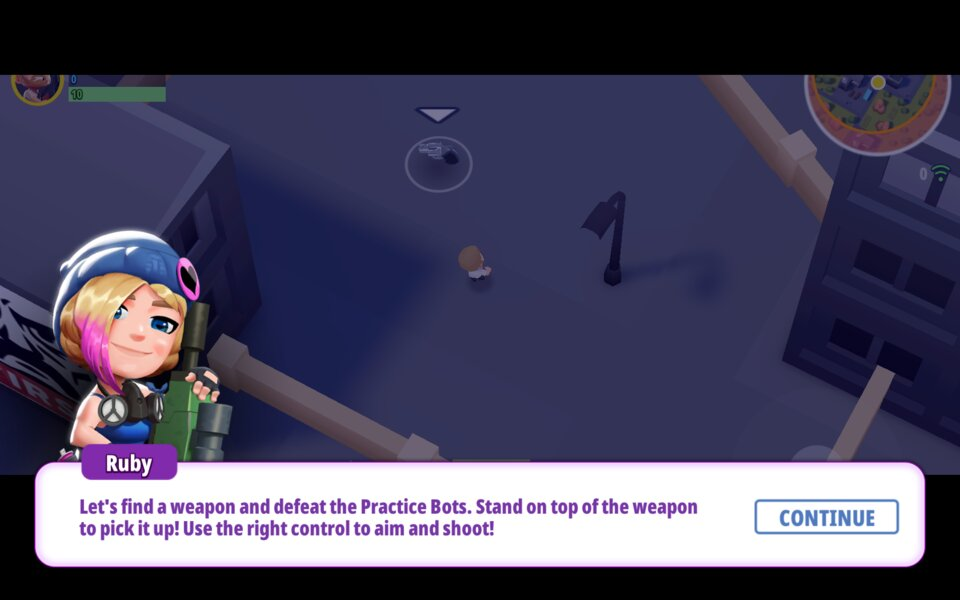 | 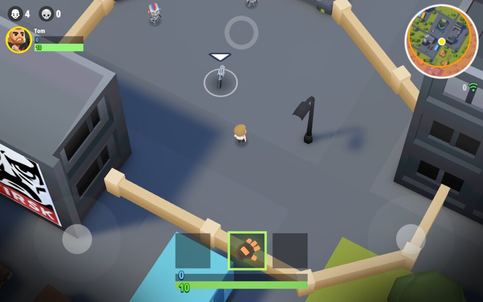 |
| In-game tutorial | Combat with HUD and practice bots |
| 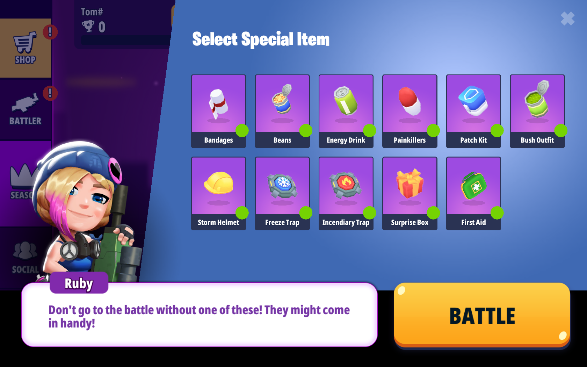 | 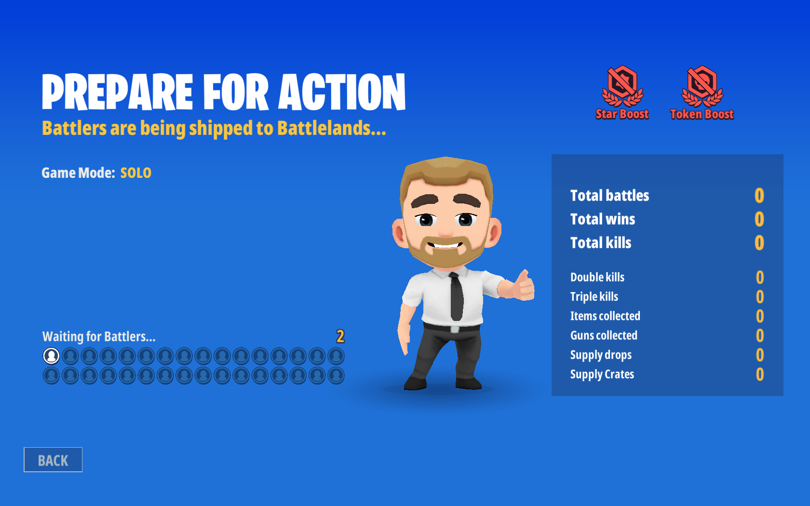 |
| Multiplayer lobby with connected players | Matchmaking with other players |
| 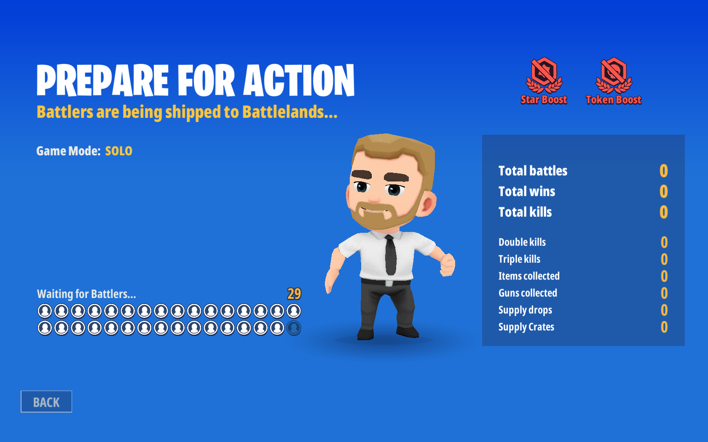 | 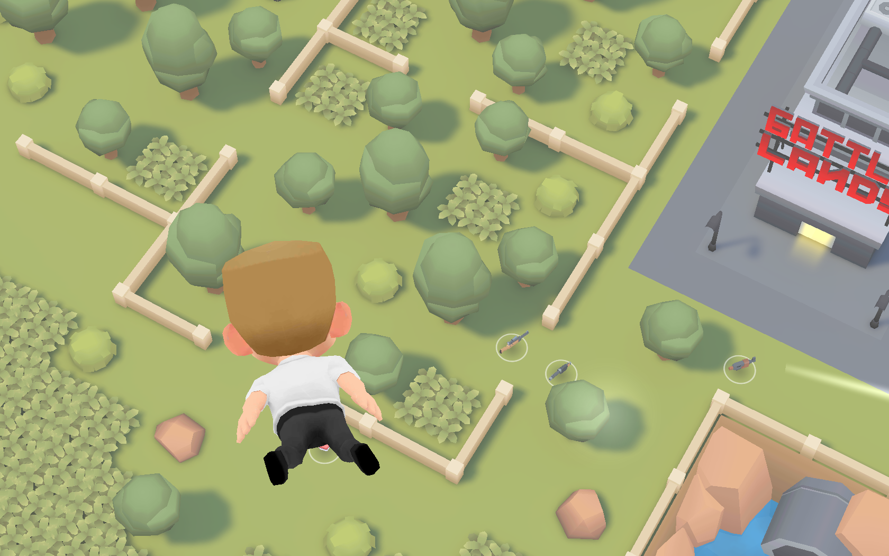 |
| Multiplayer battle in progress | Team-based combat |
| 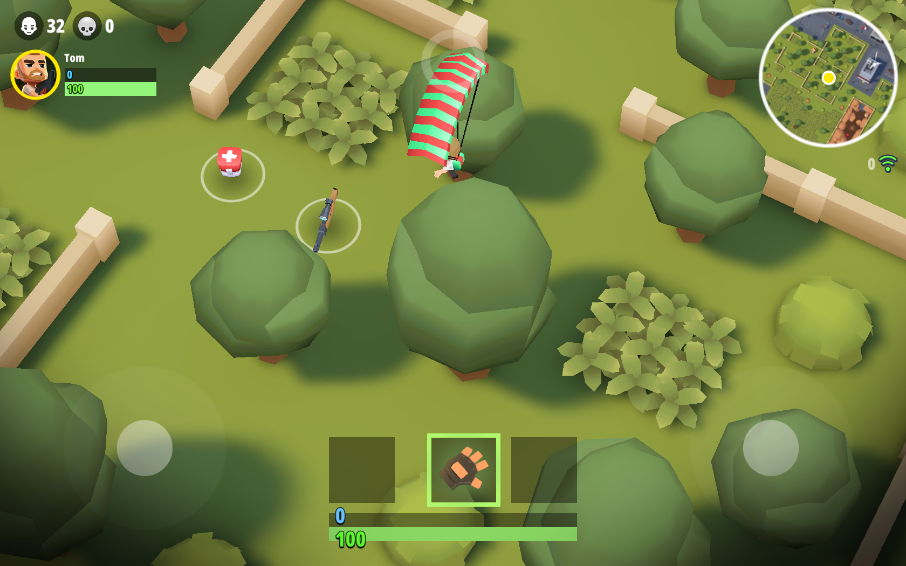 | 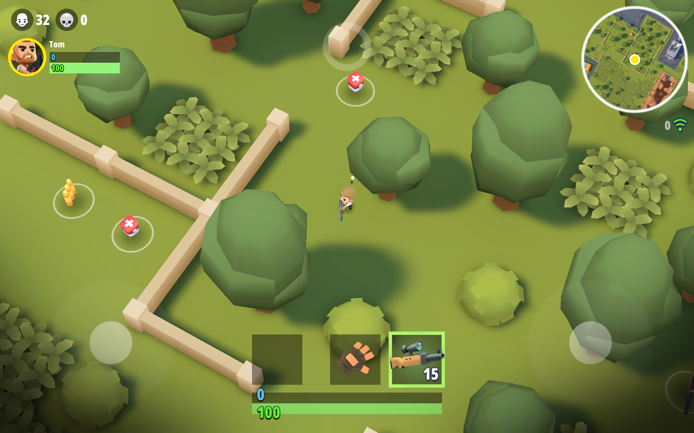 |
| Player interaction during a multiplayer match | Multiplayer scoreboard |
| 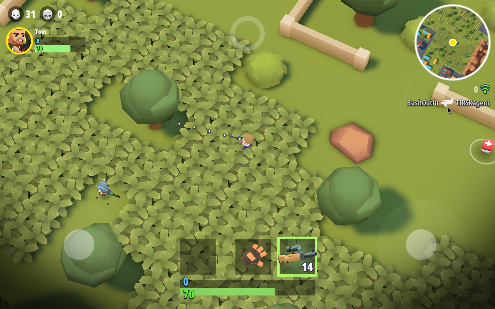 | 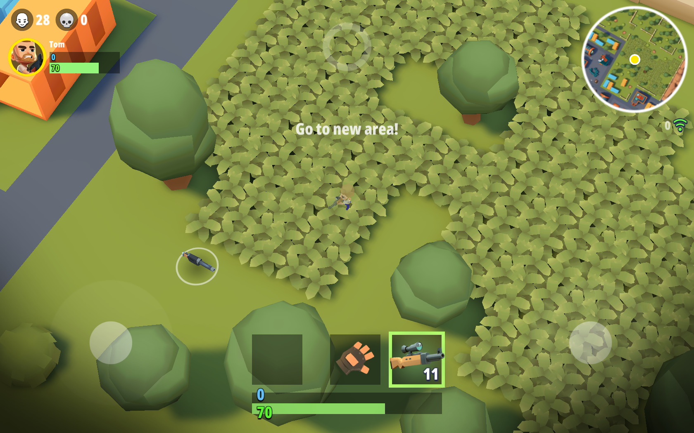 |
| Match results and player statistics | Lobby after the multiplayer match |

## Structure

```
battlelands-server/         # Private server implementation
├── app.py                  # Flask entry point
├── playfab/                # PlayFab-compatible API handlers
│   ├── auth.py             # Login, token, account linking
│   ├── data.py             # Player data, inventory, catalog
│   └── router.py           # Endpoint dispatcher
├── config/settings.py      # Server configuration
├── storage/                # File-based persistence
│   ├── catalog.json        # Item catalog (stub)
│   └── player_data.py      # Player data I/O
└── scripts/
    ├── ANDROID_SETUP.md    # Android SDK + AVD setup guide
    ├── start-emulator.sh   # Launch the AVD
    ├── install-game.sh     # Install APK on emulator
    ├── run-game.sh         # Launch game on emulator
    ├── collect-logcat.sh   # Capture filtered logs
    ├── run-server.sh       # Start local PlayFab server
    └── setup-hosts.sh      # Redirect playfabapi.com to localhost

docs/                       # Phase 1-2 analysis documents
├── BOOT_SEQUENCE.md        # 7-phase boot flow
├── SERVER_REQUIREMENTS.md  # Server endpoint specifications
└── ...                     # Engine, network, class analysis
```

## Quick Start

```bash
# 1. Run the local server
cd battlelands-server && ./scripts/run-server.sh

# 2. In another terminal: start emulator + install game
./scripts/start-emulator.sh
./scripts/install-game.sh

# 3. Redirect PlayFab API to local server
sudo ./scripts/setup-hosts.sh

# 4. Launch game
./scripts/run-game.sh

# 5. Capture logs
./scripts/collect-logcat.sh
```

## Setup from Scratch

Run `./scripts/setup.sh` to install all dependencies (Java, Android SDK, Python packages).

## Key Findings

- **Engine**: Unity 2018.4.31f1, IL2CPP backend
- **Backend**: PlayFab (SDK v2.66.190509) for auth + data
- **Networking**: Photon PUN + Quantum ECS (deterministic lockstep)
- **Config**: Firebase Remote Config for runtime overrides
- **Auth**: LoginWithCustomID (device-based) or LoginWithFacebook
- **Methods identified**: `LoginWithCustomOrDeviceId`, `ConfigLoader.FetchFirebaseConfigs`, `OverrideCacheWithFirebaseConfigs`
- **Local server support**: `LocalApiServer` property + `playfab.local.settings.json`
