# Diagramme d'architecture

```mermaid
graph TB
    subgraph "Client Android (Unity 2018.4.31f1 + IL2CPP)"
        subgraph "Unity Engine"
            U_Input["Input System"]
            U_Render["Rendering (Spine 2D)"]
            U_Audio["Audio"]
            U_UI["UGUI + Cinemachine"]
        end

        subgraph "Quantum Framework (ECS)"
            Q_Core["quantum.core<br/>- Frame<br/>- RuntimeConfig<br/>- RuntimePlayer"]
            Q_State["quantum.state<br/>- Game State<br/>- Entity State"]
            Q_Systems["quantum.systems<br/>- Actor*System (Movement, Health, etc.)<br/>- CombatController<br/>- WeaponSystem<br/>- PickupSystem<br/>- AreaEffectSystem"]
        end

        subgraph "Network Layer"
            PUN["Photon PUN<br/>- LoadBalancingPeer<br/>- PhotonView<br/>- PhotonTransformView"]
            QNC["QuantumNetworkCommunicator<br/>(custom wrapper)"]
            PFS["PlayFab Service<br/>- Login<br/>- Player Data<br/>- Catalog<br/>- Inventory<br/>- Leaderboard"]
        end

        subgraph "Services SDK"
            FB["Facebook SDK<br/>- Login<br/>- Sharing<br/>- Ads (Audience Network)"]
            FA["Firebase<br/>- Analytics<br/>- Remote Config<br/>- Auth"]
            AD["Ad Providers<br/>- AdMob<br/>- Unity Ads<br/>- Facebook Ads"]
            IAP["Unity IAP<br/>- Play Billing 3.0.3"]
            AS["AppsFlyer<br/>- Analytics"]
        end

        subgraph "UI / Screens"
            UI_Lobby["Lobby"]
            UI_Shop["Shop (BoxShop, SkinShop)"]
            UI_BattlePass["Battle Pass"]
            UI_Custom["Custom Battle"]
            UI_Match["Match HUD"]
            UI_Tutorial["Tutorial"]
        end
    end

    subgraph "Services Réseau"
        PLAYFAB["PlayFab API<br/>*.playfabapi.com<br/>HTTPS/JSON"]
        PHOTON["Photon Cloud<br/>*.exitgames.com<br/>WebSocket/Binary"]
        FIREBASE["Firebase<br/>googleapis.com"]
        FACEBOOK_GRAPH["Facebook Graph API<br/>graph.facebook.com"]
        UNITY_IAP["Unity IAP Cloud<br/>iap.cloud.unity3d.com"]
    end

    %% Connexions
    QNC --> PUN
    QNC -.-> Q_Systems
    Q_Systems --> Q_Core
    Q_Systems --> Q_State

    PFS --> PLAYFAB
    PUN --> PHOTON

    FB --> FACEBOOK_GRAPH
    FA --> FIREBASE
    IAP --> UNITY_IAP

    UI_Lobby --> PFS
    UI_Lobby --> PUN
    UI_Shop --> PFS
    UI_BattlePass --> PFS
    UI_Custom --> PUN
    UI_Custom --> PFS
    UI_Tutorial --> Q_Systems

    U_UI --> UI_Lobby
    U_UI --> UI_Shop
    U_Render --> Q_Systems

    AD --> FACEBOOK_GRAPH
    AD --> PLAYFAB

    AS --> PLAYFAB
```



## Légende

| Élément | Signification |
|---------|---------------|
| `PUN` | Photon Unity Networking |
| `QNC` | Quantum Network Communicator |
| `PFS` | PlayFab Service |
| `ECS` | Entity Component System |
| `IAP` | In-App Purchases |

## Flux de données

### Login
```
FB SDK / Device ID ──> PlayFab Login ──> Photon Token ──> Photon Connect
```

### Partie
```
Quantum Systems ──> ActorPhotonDataSerialize ──> Photon PUN ──> Photon Cloud
Photon Cloud ──> Photon PUN ──> ActorPhotonData ──> ActorView ──> Rendu
```

### Économie / Progression
```
UI ──> PlayFab Service ──> PlayFab API ──> Base de données
              │
              └──> Update locales (PlayerPrefs, fichiers)
```
